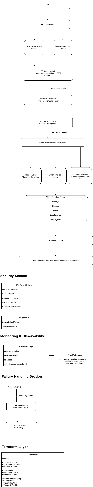

# Mini Video Processing Backend on AWS

## Project Overview

This project is a serverless video processing system built on AWS. Users can upload videos through a web application, and the system automatically generates thumbnails, stores metadata, and provides secure access to videos using pre-signed URLs.

The project demonstrates the use of AWS serverless services, event-driven architecture, Infrastructure as Code (Terraform), monitoring, and security best practices.

---

## Architecture

---

## Features

* Secure video upload using pre-signed URLs
* Automatic thumbnail generation
* Video metadata storage in DynamoDB
* Event-driven processing using S3 and SQS
* Dead Letter Queue (DLQ) for failed processing
* CloudWatch monitoring and alarms
* Infrastructure managed using Terraform

---

## AWS Services Used

* Amazon S3
* AWS Lambda
* Amazon DynamoDB
* Amazon SQS
* Amazon CloudWatch
* AWS IAM
* Terraform

---

## Project Workflow

1. User uploads a video.
2. Backend requests a pre-signed upload URL.
3. Video is uploaded to the S3 upload bucket.
4. S3 triggers an event notification.
5. Event is sent to the SQS processing queue.
6. Thumbnail Generator Lambda processes the video.
7. Thumbnail is stored in the thumbnail bucket.
8. Metadata is updated in DynamoDB.
9. Frontend displays videos and thumbnails.
10. Users access videos through secure pre-signed view URLs.

---

## Terraform Infrastructure

Terraform manages:

* S3 Buckets
* DynamoDB Table
* Lambda Functions
* SQS Queues
* Event Source Mappings
* CloudWatch Alarm
* Bucket Notifications

---

## Security

* Private S3 buckets
* IAM-based access control
* Pre-signed URLs for upload and viewing
* AWS credential management

---

## Monitoring

* CloudWatch Logs
* CloudWatch DLQ Alarm
* Error monitoring and troubleshooting

---

## Future Enhancements

* GitHub Actions CI/CD
* Remote Terraform State
* Terraform-managed IAM Roles
* User Authentication and Authorization

---

## Author

Akshay Chinthaginjala
